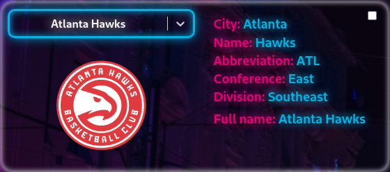
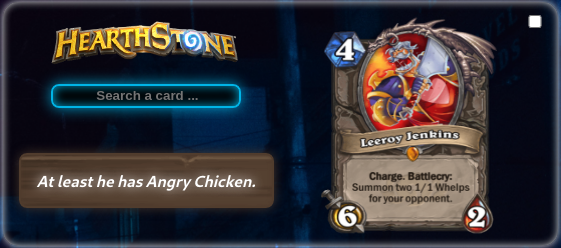
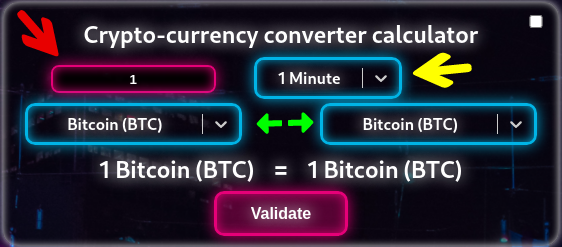
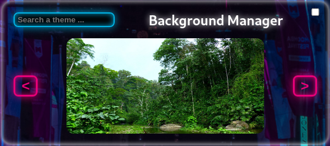
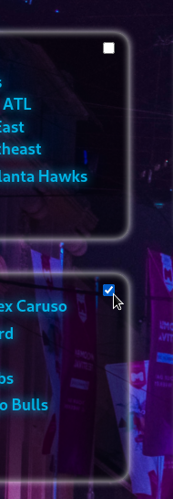

# CONNECTION

La première étape pour se connecter, est de cliquer sur le l'icone profil située en haut à droite du dashboard

Si vous disposez déjà d'un compte vous pouvez vous `Log In`, sinon vous pouvez créer votre compte en cliquant sur `Sign Up`.
Dans le second cas, il vous suffira de remplir les informations essentielles puis de recliquer sur `Sign Up` afin de valider la création de votre compte.

Il est également possible pour vous de vous connecter avec votre compte Google

# DECONNECTION 

Pour se déconnecter, rien de plus simple que de cliquer sur l'icone de déconnection en haut à droite.

# WIDGET

## NBA TEAM WIDGET

Ce widget permet d'afficher les informations essentielles sur chacune des 30 franchises actuellemenent en NBA.
Son fonctionnement est très simple, il suffit d'écrire le nom de la franchise souhaitée et les informations comme par exemple sa ville, sa conférence ainsi que son logo s'afficherons.

## NBA PLAYER WIDGET

Ce widget permet d'afficher les informations essentielles sur chacun des récents joueurs ayant joués en NBA.
Son fonctionnement est très simple, il suffit d'écrire le nom du joueur souhaité et les informations comme par son poste, son équipe ou son poid (si il est renseigné par l'api).

## HEARTHSTONE WIDGET

Ce widget permet d'afficher les informations essentielles sur chacune des cartes du jeu de cartes crée par Blizzard : Hearthstone.
Son fonctionnement est très simple, il suffit d'écrire correctement le nom de la carte souhaitée et la carte s'affichera ainsi que sa description associée.

## CRYPTO-CURRENCY CONVERTER WIDGET

Ce widget permet de connaître le taux de change en direct entre deux types de monnaies, que ce soit des crypto-monnaies ou des monnaies fiduciaires.
Plusieurs zones de saisies sont à disposition :
- la première (en haut à gauche) permet de choisir le montant que l'on veut comparer
- la seconde (au milieu en haut) permet de choisir la vitesse de rafraîchissement du taux de change
- la troisième et la quatrième (aux deux extrêmités du mileu) permettent de choisir les monnaies que l'on souhaite comparer
Il y a également le boutton bleu qui permet d'inverser de place les deux monnaies, et le bouton rouge qui permet de valider afin calculer le taux de change

## BACKGROUND WIDGET

Ce widget permet de définir l'image en arrière plan en fonction d'un mot clé choisi.
Pour cela il suffit de rentrer dans la barre de recherche un mot clé, ainsi plusieurs images en rapport avec ce mot seront chargées dans le carrousel. Il suffit ensuite de cliquer les boutons avec les flèches pour les faire défiler et choisir l'image que l'on veut.
Et donc pour transposer l'image en arrière plan il suffit de cliquer dessus.

## QUOTE WIDGET

Ce widget permet d'afficher de célèbres phrases et citations en fonction d'un mot clé choisi.
Pour cela il suffit de choisir dans le bouton déroulant un thème, et une phrase ou citation en rapport avec ce dernier remplacera la précédente, affichant également la personne ayant écrit ou prononcé celle cie.

# FONCTIONNALITÉS AUTOUR DES WIDGETS

## SUPPRIMER DES WIDGETS

Pour supprimer un ou des widgets, il suffit tout d'abord de séléctionner les widgets indésirables en cliquant sur le petite button situé en haut à droite de ces derniers

Une fois les widgets séléctionnés il ne reste plus qu'à cliquer sur l'icone poubelle placée en haut à droite du dashboard

## AJOUTER DES WIDGETS

Pour ajouter un widget il faut tout d'abord cliquer sur l'icone widget située en haut à droite du dashboard

Ainsi plusieurs nouveaux bouttons apparaiteront.
Pour ajouter un ajouter il ne suffit ainsi plus que de cliquer sur logo du widget souhaité
Et pour faire disparaitre ces bouttons il vous faut appuyer de nouveau sur l'icone widget

## DEPLACER DES WIDGETS

Les widgets étant équiper d'une fonctionnalité de drag&drop, il suffit simplement de saisir à l'aide de sa souris le widget désiré et de le déplacer à l'endroit voulu

#### *`Si en déplacant vos widgets certains disparaissent vers le bas, ne vous inquiétez pas, ils sont justes cachés`*

###### *`Ils sont assez timides`*